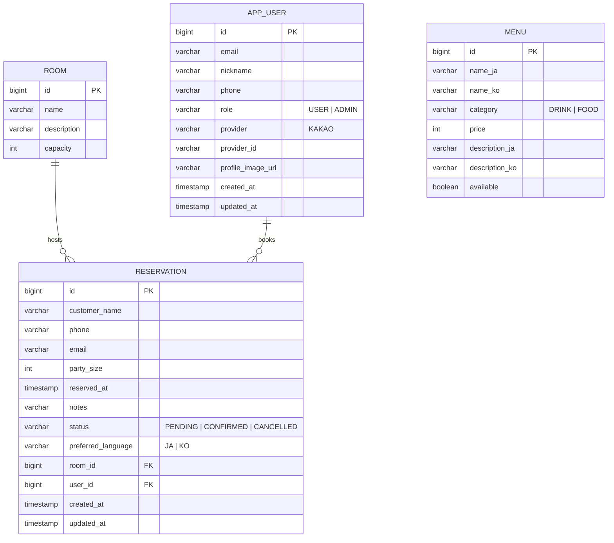

# ERD — myroom (Izakaya Reservation)

## Notes

- **ROOM ↔ RESERVATION** — optional many-to-one. A reservation may be made
  without assigning a specific room (`room_id` nullable); when assigned, the
  service checks `party_size ≤ room.capacity`.
- **APP_USER ↔ RESERVATION** — optional many-to-one. Guest bookings
  (`user_id = NULL`) remain allowed so non-registered customers can reserve.
  Authenticated users' bookings are auto-linked by the service.
- **APP_USER** uniqueness — `(provider, provider_id)` is unique so repeat
  logins from the same Kakao account reuse the existing row.
- **MENU** is standalone in MVP. Pre-ordering from the reservation flow can be
  added later via a join table `reservation_menu(reservation_id, menu_id, quantity)`.
- **i18n columns** (`name_ja`/`name_ko`, `description_ja`/`description_ko`) keep
  localized content side-by-side for simplicity. If the language list grows,
  promote to a separate `menu_translation` table.
- **Auditing** — `created_at`/`updated_at` on `app_user` and `reservation` are
  populated by Spring Data JPA auditing (`@CreatedDate` / `@LastModifiedDate`).
