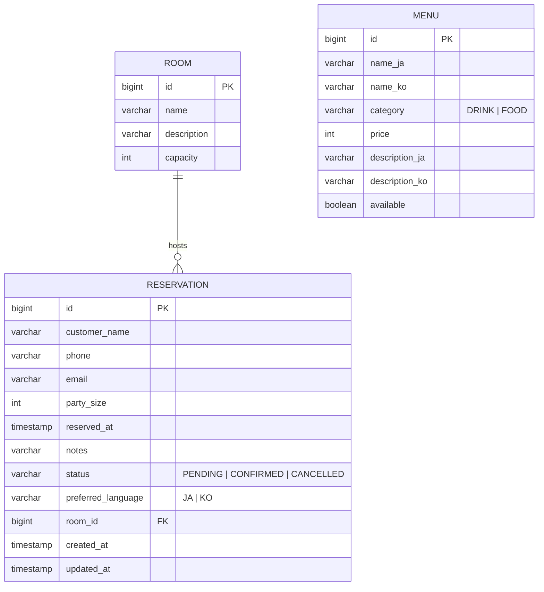

# ERD — myroom (Izakaya Reservation)

## Notes

- **ROOM ↔ RESERVATION** — optional many-to-one. A reservation may be made
  without assigning a specific room (`room_id` nullable); when assigned, the
  service checks `party_size ≤ room.capacity`.
- **MENU** is standalone in MVP. Pre-ordering from the reservation flow can be
  added later via a join table `reservation_menu(reservation_id, menu_id, quantity)`.
- **i18n columns** (`name_ja`/`name_ko`, `description_ja`/`description_ko`) keep
  localized content side-by-side for simplicity. If the language list grows,
  promote to a separate `menu_translation` table.
- **Auditing** — `created_at` and `updated_at` on `reservation` are populated by
  Spring Data JPA auditing (`@CreatedDate` / `@LastModifiedDate`).
